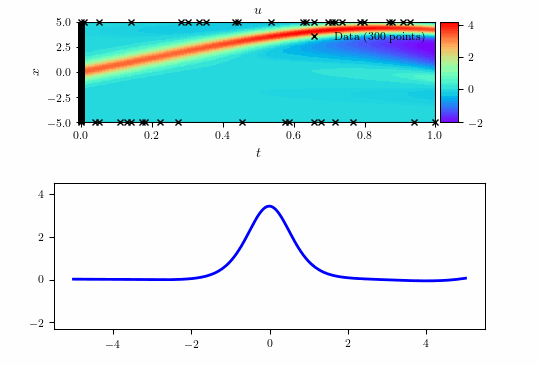
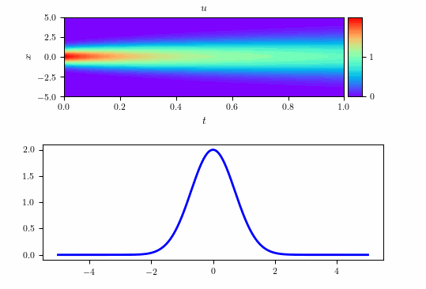
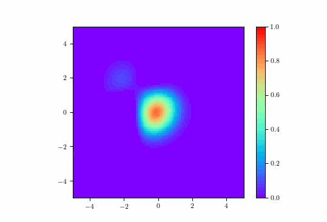

### PhysicsInformedNN

#### Physics-based Neural Networks
A physics-based neural network (PINN) is a type of function approximation using the deep perceptron. It uses initial and boundary conditions and nonlinear partial differential equations as input data to train an artificial intelligence.

#### KdV
Here, a (1+1)-dimensional nonlinear partial differential equation is solved with a Dirichlet boundary condition. The KdV equation is solved as a sample. By using the training data of the boundary condition, we can learn the Dirichlet boundary, but if we do not learn the boundary condition, the boundary will be the Free boundary.

#### periodic
Here we solve a (1+1)-dimensional nonlinear partial differential equation with a periodic boundary condition. The value of f and the slope at the boundary are used to express the periodic boundary condition.

#### Diffusion-eq
Partial differential equations in (2+1) dimensions are solved. No boundary condition is set.

